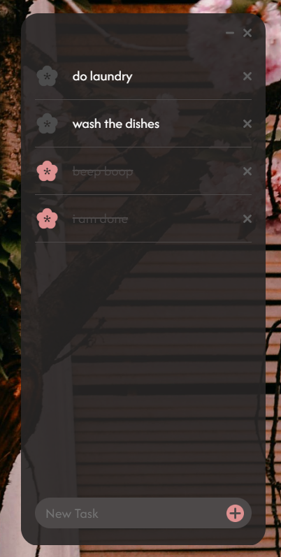
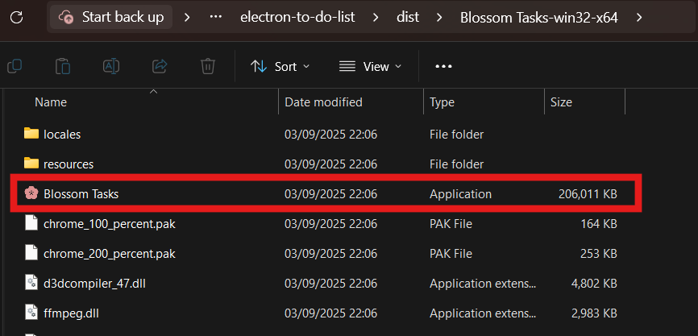
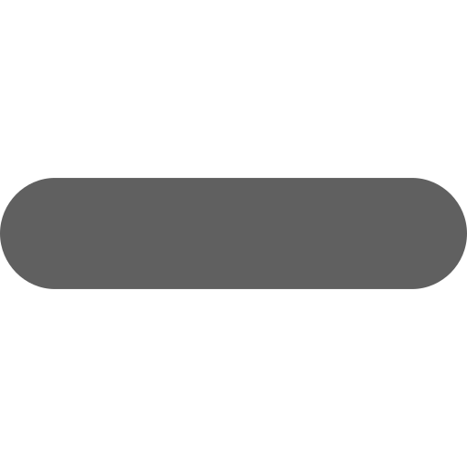
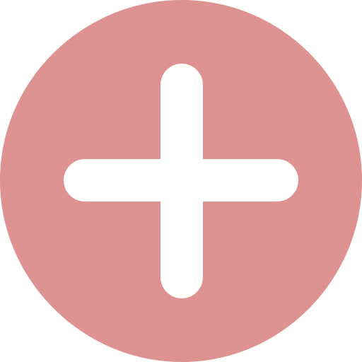
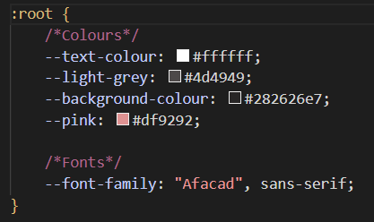

# 🌸 electron to-do list

>a beginner-friendly desktop to-do list app built with electron. this repo is a template, so copy it, learn, and make it your own!

<div align=center>
    
</div>


## ♡ what is this?

this is a simple to-do list app for windows, built with [electron](https://www.electronjs.org/). it's designed for beginners who want to learn how to build desktop apps with web technologies (html, css, js).

you can use this repo as a template to start your own electron project, experiment, and learn by doing.

i've released the app as an .exe for you to use as well!! download [here](https://github.com/NahdaaJ/electron-to-do-list/releases/tag/V1.0)🖤


## ♡ prerequisites

before you start, make sure you have:

- **node.js** installed ([download here](https://nodejs.org/en/download/)).
   - you can check by running `node -v` in your terminal.
- **npm** (comes with node.js).
   - check with `npm -v`.
- **git** installed ([download here](https://git-scm.com/downloads)).
   - check with `git --version`.
   - i made a tutorial on this, found [here](https://github.com/NahdaaJ/nahdaacodes/blob/main/tutorials/github-basics.md).

if you need help installing these, see the official websites above or search for beginner guides on youtube.


## ♡ how to make this app yours!

1. **copy the template:**
   - click the green "use this template" button at the top of the [repo page](https://github.com/NahdaaJ/electron-to-do-list).
   - choose "create a new repository".
   - name your new repo and click "create repository from template".

2. **clone your new repo:**
   ```sh
   git clone https://github.com/YOUR-USERNAME/YOUR-REPO-NAME.git
   cd YOUR-REPO-NAME
   ```

3. **install dependencies:**
   ```sh
   npm install
   ```

4. **run the app in development mode:**
   ```sh
   npm start
   ```
   the app will open in a desktop window. try adding, completing, and deleting tasks!


## ♡ how to package your app (make an .exe)

you can turn your app into a standalone windows programme using [electron-packager](https://github.com/electron/electron-packager):

1. install electron-packager:
   ```sh
   npm install --save-dev electron-packager
   ```
2. package your app:
   ```sh
   npx electron-packager . "Your App Name" --platform=win32 --arch=x64 --out=dist --icon=icon.ico
   ```
   - replace `Your App Name` with your app's name.
   - place your `icon.ico` in the project root for a custom icon.

3. find your packaged app in the `dist` folder. share the `.exe` with friends!

<div align=center>
    
</div>


## ♡ how does it work?

this app uses:
- **electron** to create a desktop window and run your web code.
- **node.js** for file operations (saving tasks to a json file).
- **html/css/js** for the user interface and logic.

### main files explained

#### `main.js` (electron entry point)
creates the app window and loads your html:
```js
const { app, BrowserWindow } = require('electron');
function createWindow() {
  const win = new BrowserWindow({
	width: 280,
	height: 560,
	type: "desktop",
	frame: false,
	transparent: true,
	webPreferences: {
	  nodeIntegration: true,
	  contextIsolation: false
	}
  });
  win.loadFile('index.html');
}
app.whenReady().then(createWindow);
```

#### `renderer.js` (ui logic)
handles adding, completing, and deleting tasks, and saves them to a json file:
```js
// add task when enter is pressed
inputEntry.addEventListener("keydown", function(event) {
	if (event.key === "Enter") {
		addTask();
	}
});

// save tasks to json in user data folder
const fs = require('fs');
const path = ... // platform-specific path
if (!fs.existsSync(path)) {
	fs.writeFileSync(path, '[]', 'utf-8');
}
```

#### `index.html` (app layout)
defines the structure of the app window:
```html
<div id="container">
	<div id="nav">
		
		
	</div>
	<div id="task-container"></div>
	<div id="task-input">
		<input type="text" id="new-task-input" placeholder="New Task"/>
		<button id="add-task-button" onclick="addTask()">
			
		</button>
	</div>
</div>
```

#### `styles.css` (styling)
uses flexbox for layout and custom scrollbars for a modern look.

## ♡ how to mess around and learn

- try changing the colours in `styles.css`.
- add new features (like editing tasks, due dates, etc).
- change the window size or style in `main.js`.
- replace icons in the `images` folder.
- experiment with saving more data to the json file.

<div align=center>
    
</div>


## ♡ troubleshooting

- if you get errors, make sure you have node.js and npm installed.
- if the app doesn't start, check your electron version in `package.json`.
- for windows, make sure your icon is a `.ico` file.
- you can also reach out to me if you need!

## ♡ credits

made by nahdaaj while learning electron. feel free to fork, star, and share! 🌸

## ♡ find me elsewhere
i'm just a junior software engineer, so i'm still learning too. don't be afraid to not know stuff, and keep trying!

- tiktok: [@nahdaacodes](https://tiktok.com/@nahdaacodes)
- github: [@nahdaaj](https://github.com/nahdaaj)
- personal website: [nahdaajawed.com](https://nahdaajawed.com/)

feel free to reach out if you have any suggestions, ideas or just need help understanding something!
i'd love to meet you 🖤

